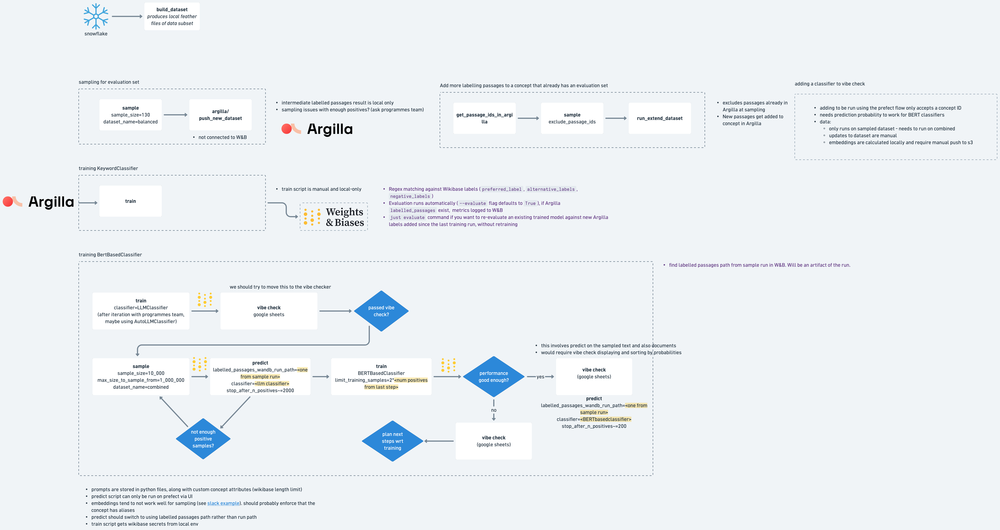

# Runbook

Operational procedures for the knowledge graph: what to run, what to expect, what to do when it
fails.

## Contents

- [Labelled datasets in Argilla](#labelled-datasets-in-argilla)
- [Classifiers](#classifiers)
- [Deploys and pipelines](#deploys-and-pipelines)

## Labelled datasets in Argilla

Human annotators label passages in Argilla. Datasets are named after the concept's Wikibase ID
(e.g. `Q287`) in the `knowledge-graph` workspace. This is the data classifiers are trained and
evaluated against.

### Create an evaluation set for a concept that has none

```bash
uv run prefect deployment run \
  'create-evaluation-dataset-in-argilla/kg-create-evaluation-dataset-in-argilla-prod' \
  -p wikibase_id=<WIKIBASE_ID> \
  -p sample_size=<SAMPLE_SIZE> \
  -p limit=<SAMPLE_SIZE> \
  -p prelabel_with_llm_ensemble=true
```

> [!IMPORTANT]
> `sample_size` and `limit` both default to `130`, and it's `limit` that caps how many passages
> actually reach Argilla. Raising `sample_size` alone samples more and still pushes only 130 — set
> both to the same number.

`prelabel_with_llm_ensemble` pre-populates annotator suggestions with an LLM ensemble. It is **on by
default**; pass `-p prelabel_with_llm_ensemble=false` to skip it.

### See which concepts already have an evaluation set

Run it locally:

```bash
set -a && source .env && set +a

uv run python -c "
from knowledge_graph.labelling import ArgillaSession
print(sorted(d.name for d in ArgillaSession().get_all_datasets('knowledge-graph')))
"
```

Needs `ARGILLA_API_URL` / `ARGILLA_API_KEY`; both are in `.env`, which `uv run` will not load on its
own - hence the `source`.

### Add more labelling passages to a concept that already has a dataset

The flow samples fresh passages itself, excluding everything already in the dataset
from the sampling pool, so every passage an annotator sees is new:

```bash
uv run prefect deployment run \
  'extend-existing-dataset/kg-extend-existing-dataset-prod' \
  -p wikibase_id=<WIKIBASE_ID> \
  -p n_new_passages=<n>>
```

`n_new_passages` defaults to `50` and is the number of new passages added. There is also a
`sample_size`, which defaults to `n_new_passages` - you only need it if you want to draw from a
larger pool than you intend to add.

#### When fewer new passages are available than requested

`NotEnoughNewPassagesError` means the concept's pool is exhausted: after excluding what's already
labelled, sampling couldn't produce `n_new_passages`. Nothing is written to Argilla - the check runs
before the push, so the dataset is untouched and the run is safe to repeat once you've decided which
of these you want:

| response | command | effect |
| --- | --- | --- |
| widen the pool | `-p dataset_name=combined` | samples the unbalanced English corpus instead of the balanced dataset. |
| accept fewer | `-p raise_on_insufficient_passages=false` | warns instead of failing and adds every new passage it did find. Re-running later tops up, since what's added now is excluded next time |
| ask for less | `-p n_new_passages=<smaller>` | succeeds outright if the smaller number is available |

`raise_on_insufficient_passages` defaults to `true` on the flow, so a shortfall fails loudly rather
than quietly under-filling. The local script and the underlying operation default to `false`.

Two caveats on retrying. The dataset is untouched, but the `sample` flow has already run by the
time the error fires, so each attempt costs a sampling run and logs a new W&B artifact version. And
`combined` is not unbounded: `max_size_to_sample_from` defaults to `500_000` and takes the first
500k rows rather than a random slice, so raise it too if the concept is sparse.

`No positive passages found` means neither the keyword nor the embedding
classifier matched anything. Try `dataset_name=combined`,
then check the concept's labels in Wikibase - a concept with no corpus presence can't be sampled for.

### Run a flow locally instead of via a deployment

```bash
set -a && source .env && set +a
export AWS_PROFILE=prod        # .env ships AWS_PROFILE=labs; override it for prod work
export WANDB_DIR=./data/wandb  # only the justfile exports this

uv run python -c "
import asyncio
from flows.extend_existing_dataset import extend_existing_dataset
from knowledge_graph.identifiers import WikibaseID
print(asyncio.run(extend_existing_dataset(
    wikibase_id=WikibaseID('Q287'), n_new_passages=5
)))
"
```

`AWS_ENV` must also be set. `Config` reads it directly, and `.env.example` ships it empty,
which fails with `ValueError: '' is not a valid AwsEnv` before anything else happens.

Also needs `uv run prefect cloud login`. `Config.create()` reads a Prefect Variable for the cache
bucket. If AWS calls fail with `TokenRetrievalError`, re-run `aws sso login --profile prod`.

## Classifiers

Training uses the passages labelled in Argilla for the concept, so if a concept has too little
training data, [Add more labelling passages to a concept that already has a dataset](#add-more-labelling-passages-to-a-concept-that-already-has-a-dataset).

### Train a classifier

​```bash
uv run train --wikibase-id <WIKIBASE_ID> --compute <local|remote-cpu|remote-gpu>
​```

`--compute local` runs in-process; `remote-cpu` / `remote-gpu` dispatch the `train-on-cpu` /
`train-on-gpu` Prefect deployments (the model won't be available locally afterwards). Use
`remote-gpu` for BERT classifiers and `remote-cpu` / `local` for the rest — the `--compute` help
says the same. Uploads to S3 and links from W&B when `--track-and-upload` (the default) is on.

Local training needs an active AWS session with S3 access (`AWS_PROFILE=…` with
`USE_AWS_PROFILES=true`, or equivalent creds). `--aws-env prod` and `--track-and-upload` are
the defaults; `--no-track-and-upload` skips W&B tracking and the S3 upload.

### Training pipeline



1. **Train an `LLMClassifier`** for the concept, a prompt-based classifier
   (`knowledge_graph/classifier/large_language_model.py`).
2. **Iterate the prompt with `AutoLLMClassifier`** (`knowledge_graph/classifier/autollm.py`). Its
   `fit()` runs `n_trials` optimisation trials against the concept's labelled passages, using an
   optimiser model to rewrite the labelling guidelines and keeping the best trial by f-beta score.
3. **Generate training data** — run the tuned LLM classifier over unlabelled passages (the predict
   flow / `run_prediction`) to produce LLM-labelled passages, uploaded as a W&B artifact.
4. **Train a BERT classifier on that data** — point a per-concept YAML config's
   `training_data_wandb_path` (`BERTClassifierConfig`) at that artifact, then
   `uv run train --from-yaml-config <config> --classifier-type BertBasedClassifier --compute remote-gpu`.

### Promote, demote and update specs

> [!IMPORTANT]
> With model hot swapping you should ideally only train via the CLI and let promotion and demotion be
> handled by the classifiers profiles sync pipeline, which uses Wikibase as the source of what to
> promote and demote. That applies to **production**. The manual steps below are still valid in some
> scenarios, such as re-training after a bug fix.

That pipeline is `sync-classifiers-profiles/kg-sync-classifiers-profiles-prod`. It reads Wikibase,
then promotes, demotes, refreshes the classifier specs and opens the specs PR in one run. It's
scheduled `0 10,17 * * MON-THU` in prod, so usually you just wait for it — but you can trigger it:

```bash
uv run prefect deployment run 'sync-classifiers-profiles/kg-sync-classifiers-profiles-prod'
```

Everything below is the manual fallback. Promotion adds the model to the W&B registry; setting it
primary gives it the environment alias. Each promoted classifier ID needs exactly one classifiers
profile, set during promotion or via `classifier-metadata`.

```bash
just demote Q123 --wandb-registry-version v10 --aws-env prod
just promote Q123 --classifier-id abcd2345 --aws-env prod --add-classifiers-profiles primary
just update-inference-classifiers --aws-envs prod
```

Demoting isn't always required - two versions can coexist in one environment provided they're in
different classifiers profiles.

Or do train-through-spec-update in one step, when you already know the model will become primary:

```bash
just deploy-classifiers "Q374" prod
just deploy-classifiers "Q374 Q473" prod     # sequential batch
```
Use the plural `deploy-classifiers` even for a single concept. The singular `just deploy-classifier`
passes the ID positionally to `uv run deploy new`, which only accepts `--wikibase-id`, so it fails
with an unexpected-argument error.

To stop using a specification, demote it - this removes the tag and the classifiers profile for the
latest version in that environment:

```bash
just demote Q57 --aws-env prod
```

Then update the specs as usual.

### Control where a classifier runs

No deployment exists for classifier metadata - it's CLI-only.

Adding a source stops documents from that source having inference run with this classifier:

```bash
just classifier-metadata Q123 abcd2345 prod --add-dont-run-on sabin
just classifier-metadata Q123 abcd2345 prod --clear-dont-run-on --add-dont-run-on sabin --add-dont-run-on gef
just classifier-metadata Q123 abcd2345 prod --clear-dont-run-on      # allow everything
```

Require a GPU compute environment (`--clear-require-gpu` reverts to CPU):

```bash
just classifier-metadata Q123 abcd2345 prod --add-require-gpu
```

Apply to every promoted classifier in an environment's spec:

```bash
just classifier-metadata-entire-env prod --add-dont-run-on sabin
```

### Train in Docker

Reach for this only when you need to reproduce the deployment image locally - debugging a dependency
or a spec-writing problem that doesn't reproduce on your laptop. For ordinary training use
[the deployments](#train-a-classifier), and for promotion the
[profiles sync pipeline](#promote-demote-and-update-specs).

The image is built locally and key directories are mounted so classifier
spec updates persist back to the repo and the AWS CLI stays authenticated.

```bash
just build-image
aws sso login --profile staging          # caches a token in ~/.aws/sso/cache for the container

docker run \
  --env-file .env \
  -v ~/.aws:/root/.aws:ro \
  -v ~/.aws/sso/cache:/root/.aws/sso/cache:ro \
  -v $(pwd)/flows/classifier_specs/v2:/app/flows/classifier_specs/v2 \
  -e AWS_PROFILE=staging \
  -it ${DOCKER_REGISTRY}/${DOCKER_REPOSITORY}:${VERSION} /bin/sh
```

The mount target must be `/app/flows/...`: the image's `WORKDIR` is `/app` and the spec directory is
resolved relative to it, so a root-level `/flows/...` mount is written to by nothing.

`VERSION` isn't in `.env` - export it first with `export VERSION=$(just get-version)`.

Check AWS works inside the container with `aws s3 ls`, then run the pipeline:

```bash
uv run deploy new --aws-env prod --train --promote --wikibase-id Q1651
```

If the local classifier spec files don't update afterwards, check the mount target above, then exit
the container and run `just update-inference-classifiers`.

### Troubleshooting

**W&B `403 Forbidden` / `Permission denied to access team/classifier/version`** - permissions are
needed for both projects *and* the [model
registry](https://docs.wandb.ai/guides/registry/configure_registry/). With project access only,
training succeeds and `promote` fails when it reaches the registry.

**Training can't find the concept or its data** - confirm the Wikibase ID exists and has labelling
data in Argilla; see [Sample for evaluation set](#sample-for-evaluation-set).

Also check AWS credentials are configured before starting the container, that `.env` has everything,
and that the classifier specs directory is reachable from inside it.

## Deploys and pipelines

Inference → aggregation, individually or as `topic_pipeline`. Explained in the
[root README](./README.md#pipelines). Indexing is a
separate flow you run yourself.

### Check whether a deploy has landed

CI runs on merge to `main` and deploys Sandbox; the `CD` workflow triggers on `CI` completing and
deploys Labs, Staging and Prod. So there are two waits:

```bash
gh run list --limit 5
gh run view <cd-run-id> --json jobs --jq '.jobs[] | "\(.name) \(.status) \(.conclusion // "-")"'
```

> [!NOTE]
> CI ignores markdown-only changes, so a merge that touches nothing but `*.md` produces no CI run,
> therefore no CD run, therefore no deploy.

All three environment jobs (Labs, Staging, Prod) should be `success`. Then confirm the deployment
carries the new code:

```bash
uv run prefect deployment inspect 'extend-existing-dataset/kg-extend-existing-dataset-prod'
```

Names follow `kg-<flow_name>-<aws_env>`, the flow name being the function name with underscores
replaced by hyphens, and `aws_env` being `prod` (not `production`) for production. Browse them in the
[Prefect
dashboard](https://app.prefect.cloud/account/4b1558a0-3c61-4849-8b18-3e97e0516d78/workspace/1753b4f0-6221-4f6a-9233-b146518b4545/deployments?g_range={%22type%22:%22span%22,%22seconds%22:-2592000}),
or see [Monitoring Deployment status](./README.md#monitoring-deployment-status).
