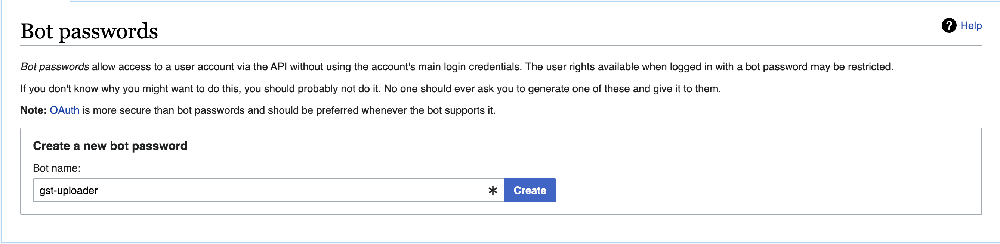

# Creating a bot user

The `scripts/populate_wikibase.py` script should be run with a bot user account, as it will make many edits to the Wikibase instance. To create a bot user, follow these steps:

- Go to [the Special:BotPasswords page](https://climatepolicyradar.wikibase.cloud/wiki/Special:BotPasswords)
- Set a descriptive username and click "Create"
- Set the appropriate permissions for the bot user
- Copy the generated username and password and set them in the `.env` file
- Run the script with the bot user credentials
