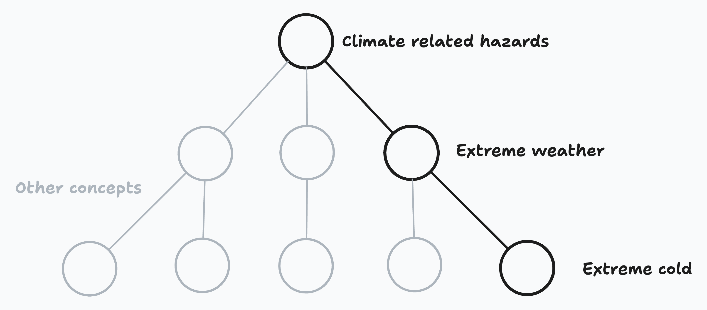
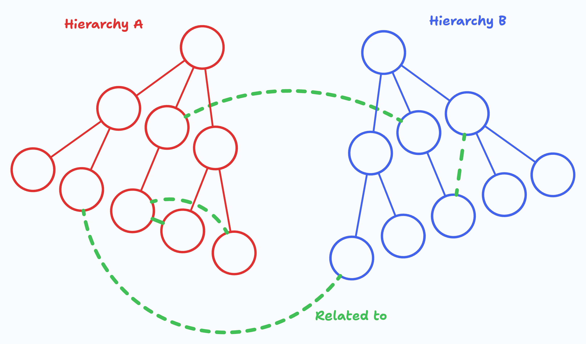
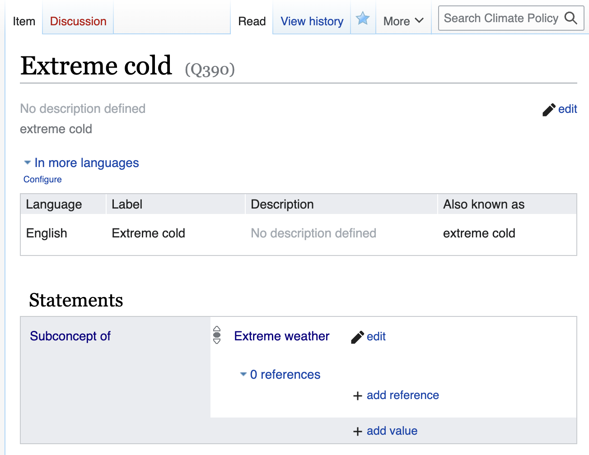

# Getting started with the concept store

This is a guide to getting started with the concept store as a front-end user. It's aimed at policy team members or external users who are new to wikibase (or our implementation of it).

After reading these pages, you should have a decent understanding of how the concept store is structured, be able to create and edit concepts, and feel confident about how your edits will affect downstream services like concept pages, classifiers, and the knowledge graph.

## What is the concept store?

The concept store is our way of managing the climate concepts we care about, and the relationships which link them together.

For example, we might have a concept for `Extreme Cold`, which is a subconcept of `Extreme Weather`, which is a subconcept of `Climate Related Hazards`. The relationships between these ideas give us a clearer picture of how they fit into the climate policy landscape, and an easy way to navigate between them.

Each of these concepts will have its own page in the concept store, containing some metadata about the concept, its relationships to other concepts, and a record of changes which have been made to the concept over time.

### The concept store is a bit like wikipedia

The concept store is similar to wikipedia, in that:

- It is a collaborative platform, where collective knowledge is built up over time by a community of users (like you!).
- The data can be queried and used in other applications, like our classifiers or the knowledge graph.
- It's built with [wikibase](https://en.wikipedia.org/wiki/Wikibase), which is the same software that powers [wikidata](https://www.wikidata.org/wiki/Wikidata:Main_Page)! If you're familiar with wikidata, you'll probably find it easy to work with the concept store.

### The concept store is not like wikipedia

There are a few key differences between the concept store and wikipedia:

- **It's more focused:** Our concept store is specifically for _climate_ concepts, rather than all human knowledge. We're not trying to build a model of the entire world.
- **It's more structured:** Like _wikidata_, we're interested in collecting _structured data_ about our concepts, rather than free-text descriptions.
- **It's more connected:** We're very interested in the relationships between concepts, and how they can be used to build up a [knowledge graph](../developers/concept-store-vs-knowledge-graph.md). Without the relationships, we would still be able to build individual concept classifiers, but paying attention to how they're connected will allow us to _really_ unlock its potential.

### Concept item pages

Each concept in the concept store is given its own Item in the concept store (a page with a QID, eg [Q42](https://climatepolicyradar.wikibase.cloud/wiki/Item:Q42)), with fields for:

- **A preferred label:** The typical name used to refer to the concept, or the name which is used by the people who are most invested in the concept
- **Alternative labels:** Other names which might be used to refer to the concept, including abbreviations, synonyms, or translations into other languages. This field might also include common misspellings, misnomers, or offensive terms which are used to refer to the concept (depending on the context and the type of classifier we're building).
- **A description:** A one or two sentence description of the concept, which could be used to disambiguate it from other, similar concepts.
- **Statements:** Optional structured data about the concept, like its relationships to other concepts. Each statement is made up of an **item**, a **property**, and a **value**. For example, the statement `Extreme Cold` `Subconcept of` `Extreme Weather` (item, property, and value respectively) would be used to describe the relationship between two concepts.

### Relationships

At the moment, we work with two types of relationship between concepts:

- **Hierarchical relationships:** These are relationships which describe how one concept is a subconcept of another. For example, `Extreme Cold` is a subconcept of `Extreme Weather`. These are often lifted from hierarchical third-party taxonomies. For example, our taxonomy of technologies is based on [the UN Climate Technology Centre and Network’s taxonomy of climate technologies](https://www.ctc-n.org/resources/ctcn-taxonomy).  
  The concept store allows you to set `Subconcept of` and `Has subconcept` relationships between concepts, which can be used to build up a hierarchy of concepts.

- **Non-hierarchical relationships:** Hierarchies are an intuitive way to start organising concepts, but they're not the best/only way. As more complexity builds up over time, limiting ourselves to working within a single hierarchy can become very restrictive! Non-hierarchical relationships are a good way to link concepts together in contexts where hierarchy becomes too restrictive. They also allow us to draw relationships across different hierarchies, which can be very useful for representing several perspectives on a single concept. See [hierarchy heuristics](./hierarchy-heuristics.md) for more guidance on how to structure these relationships.
  The concept store allows you to set a `Related to` relationship between concepts, which can be used to link concepts together when hierarchical relationships aren't appropriate.

Here's a visual example of how hierarchical and non-hierarchical relationships between concepts might look:

### History

Each concept page has a 'View history' tab, which shows a record of changes which have been made to the concept since it was created. You can see the 'View history' tab in the top right of the page, next to the search bar:

This should allow us to see who made changes, when they were made, and what the changes were. If we decide that a change was made in error, we can revert to an earlier version of the concept with a single click. Ideally, new edits or reversions should be discussed with the team on the concept's corresponding [talk page](./talk-pages.md) before they're made, and the reasons for the change should be tracked in the edit summary.

Take a look at [auditing a concept's history](./auditing-a-concepts-history.md) for more information on how to use the 'View history' tab.
