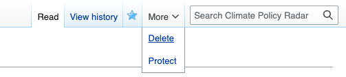

# Deleting a concept

To delete a concept, click the `More ▼` button in the top right hand corner of the concept page, and select `Delete`.

NB You'll need the `delete` permission to delete a concept. If you don't see the `Delete` button, you might not have the necessary permissions. If you think you should have the permission, reach out to an admin to get it added to your account. You can see [a full list of current admin accounts here](https://climatepolicyradar.wikibase.cloud/wiki/Special:ListUsers/sysop)
