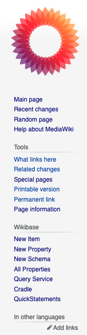
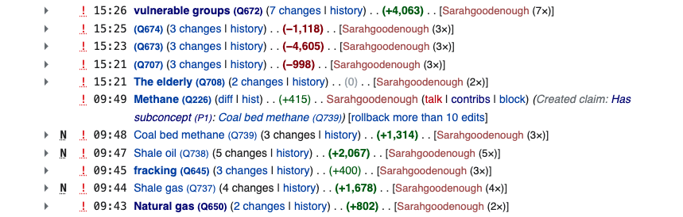

# Patrolling changes

The concept store is a living document, and changes are made to concepts all the time. It's important to make sure that the changes are accurate and complete before they are used in downstream services. This is where patrolling comes in.

## What is patrolling?

Patrolling is the process of reviewing changes to the concept store to ensure that they are accurate and complete. It's a way of making sure that the concept store is a reliable source of information.

Everyone can patrol changes in the concept store. If you see a change that you think is incorrect, you should start a discussion on the concept's talk page to resolve the issue, tagging the user who made the change so that they can respond.

## How to patrol changes

The best way to keep on top of your patrolling duties is to check the recent changes to the concept store. You can do this by clicking the `Recent changes` link in the sidebar.

This will take you to a list of the most recent changes to the concept store. You can filter this list by user, date, or type of change to make it easier to find the changes you're interested in. Unpatrolled changes will be marked with a red exclamation mark ❗️.

When you find a change that you want to patrol, click the `diff` link next to the change. If there are multiple changes, the same button will be labelled eg `2 changes`. This will take you to a side-by-side comparison of the changes made.

At the bottom of the diff page, you'll see a `Mark as patrolled` button. Click this button to mark the change as patrolled.
