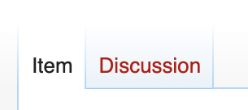

# Talk pages

Each page in wikibase has an associated **Talk page** (or **Discussion page**) which editors can use to discuss improvements to the content. The talk page is always under the "discussion" tab at the top of each page.

Talk pages are well documented by wikipedia, so I'll leave it to them to explain how they work in more detail. It's best to start with [this simple introduction to talk pages](https://en.wikipedia.org/wiki/Help:Introduction_to_talk_pages/All). It's also worth checking out [this longer guide to talk pages](https://en.wikipedia.org/wiki/Help:Talk_pages) if you still have questions.

## When to use talk pages

If you're unsure about a change, or if you think a change might be controversial, it's a good idea to start a discussion on the talk page first. This is also true of reversions - if you're reverting other people's work, it's a good idea to discuss it on the talk page first.

## Tagging each other

If you create a new topic on a talk page, you should make sure you select the "watch" checkbox so you get notifications when people reply.

If you want to get someone's attention on a talk page, you can tag them by typing `[[User:REPLACE_THIS_WITH_THEIR_USERNAME]]` in your message. This will create a link to their user page and send them a notification that they've been tagged!

## Catching up on recent discussions

To see a list of recent changes to talk pages, you can check the [Recent changes](https://climatepolicyradar.wikibase.cloud/wiki/Special:RecentChanges?hidebots=1&namespace=121&limit=500&days=30&enhanced=1&urlversion=2) page and filter for "Item talk" pages.
