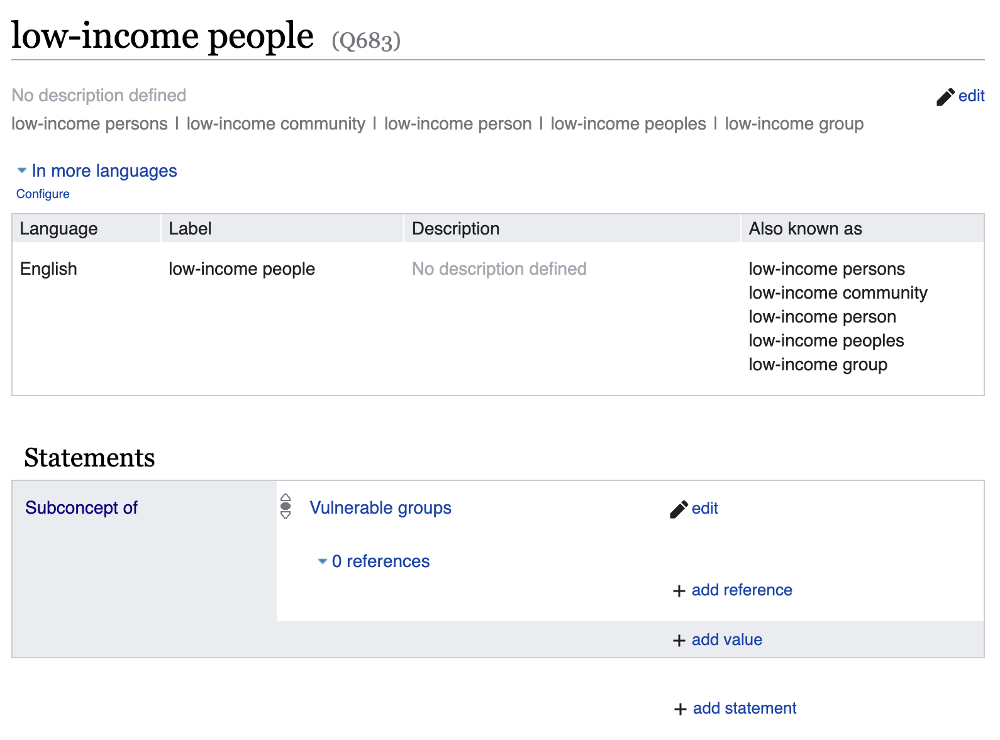

# Adding relationships between concepts

Relationships between concepts are set as **statements** on the concept page. 

Each statement is made up of an **item**, a **property**, and a **value**. For example, the statement `Extreme Cold` `Subconcept of` `Extreme Weather` (item, property, and value respectively) would be used to describe the relationship between two concepts. It would be displayed on the concept page for `Extreme Cold`.

## Adding a new relationship

To add a new statement, click the `+ add statement` button in the top right hand side of the item content.

A form will appear where you can add a new statement. The form will prompt you for the following information:

- **Property:** The property that describes the relationship between the two concepts. You can search for the property you want to use by starting to type. The value should be one of [the properties in the concepts store](https://climatepolicyradar.wikibase.cloud/wiki/Special:ListProperties).
- **Value:** The concept that the item is related to. You can search for the concept you want to use by starting to type.

You might be prompted to add a [qualifier](https://www.wikidata.org/wiki/Help:Qualifiers) or [rank](https://www.wikidata.org/wiki/Help:Ranking) to the statement. These are optional, and we aren't currently using them in the concepts store.

## References

Each statement can be supported by an optional reference. To add a reference, click the `+ add reference` button on the right hand side of the statement you want to reference. The value should be a URL to a reliable source that supports the statement.

## Editing relationships

To edit a relationship, click the `✏️ edit` button on the right hand side of the statement you want to change. Make the necessary changes in the form that appears, and click `✅ save` to save your changes. To abandon your changes, click `❌ cancel`.

## Deleting relationships

To delete a relationship,`✏️ edit` button on the right hand side of the statement you want to change, and then click the `🗑️ remove` button.

If you want to undo the deletion, go to the item's history, find the appropriate revision in the list, and click the corresponding `undo` button.
