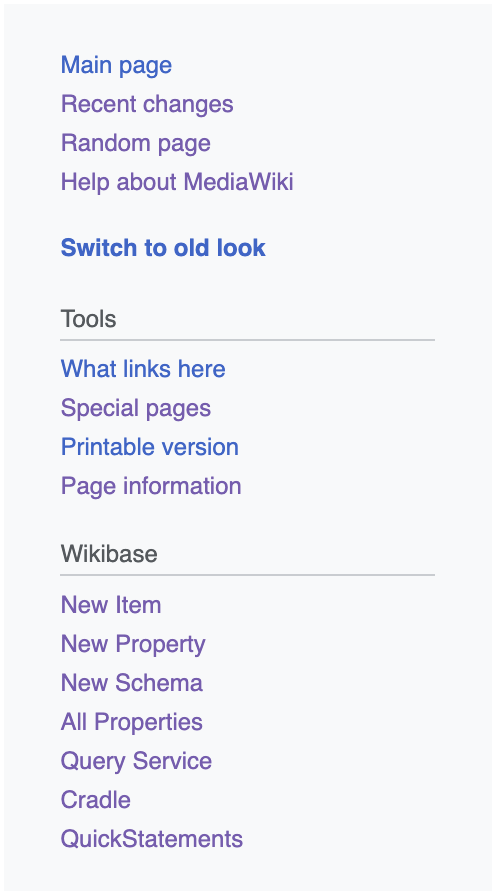
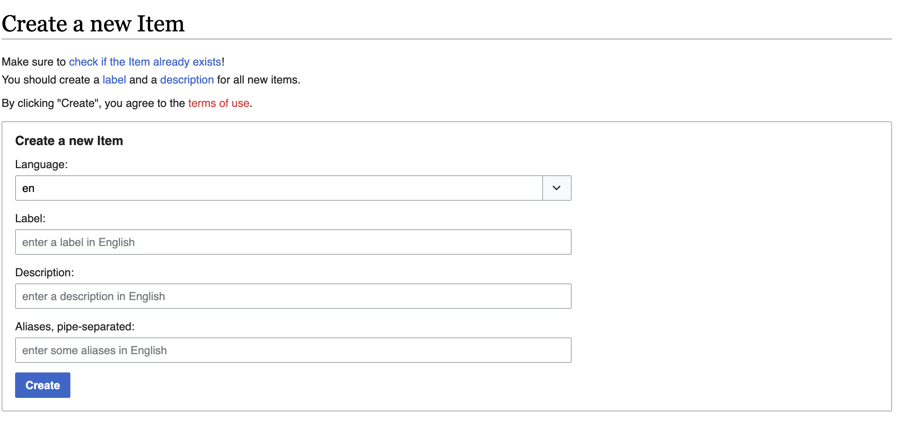

# Creating a new concept

- On [climatepolicyradar.wikibase.cloud](https://climatepolicyradar.wikibase.cloud/), you should see a menu the left hand side of the screen

- Click on `Create a new item`, and (leaving the default language as "en") enter
  - **A label:** this is the preferred label for the concept
  - **A description:** A one or two sentence description of the concept, which could be used to disambiguate it from other, similar concepts.
  - **A list of aliases:** Alternative labels for the concept. These should be pipe separated, ie interspersed with the "|" character. For example, the concept `"Greenhouse gases"` might have aliases `"GHG | ghgs | greenhouse gas | green-house gases"` etc.

- Click the `Create` button
