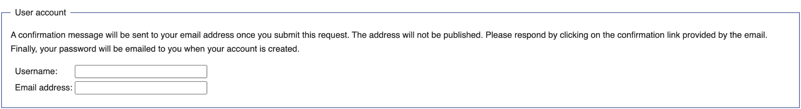
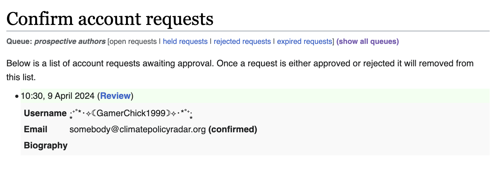
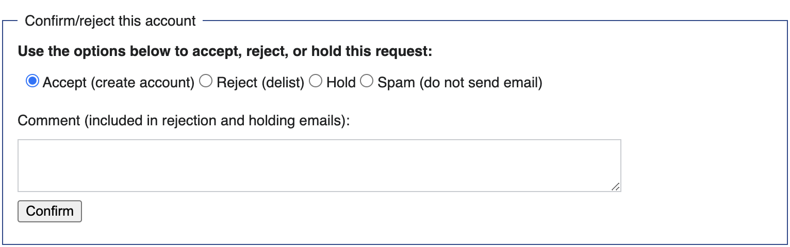
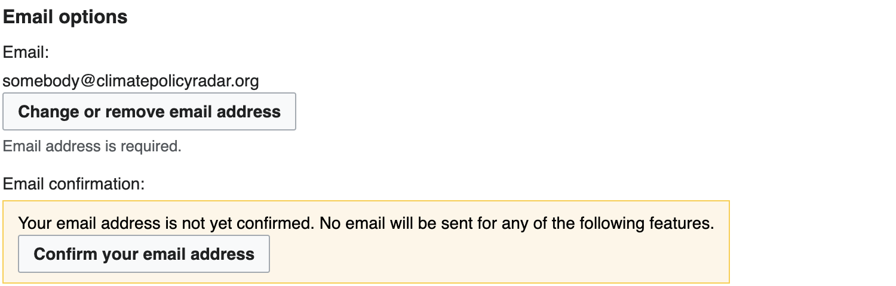
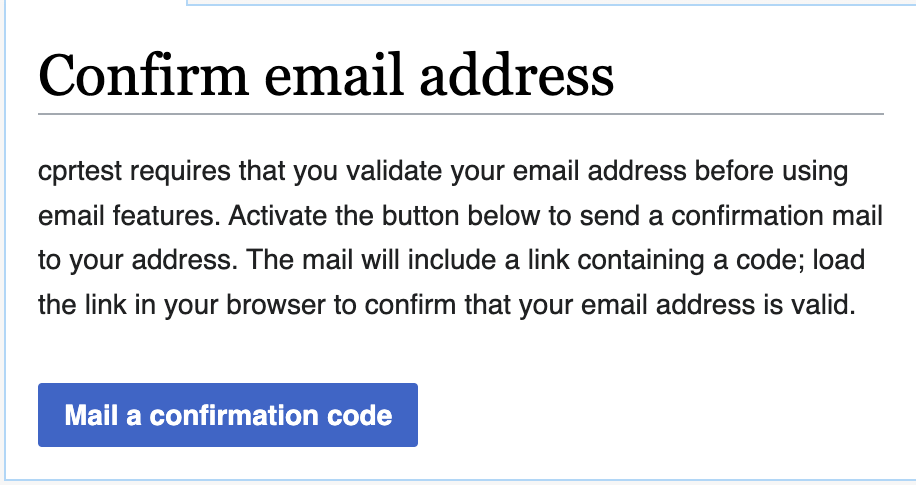
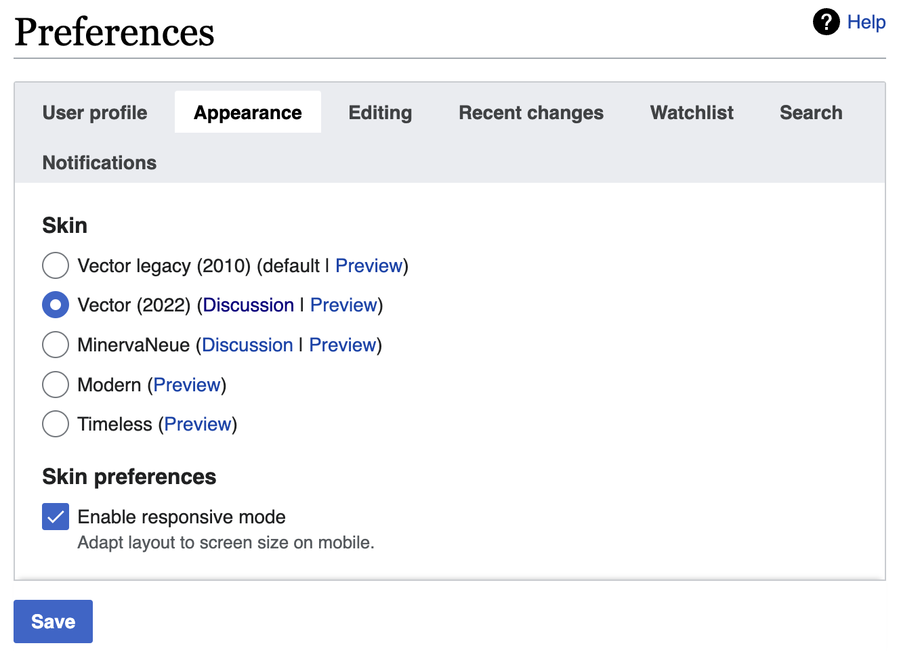

# Creating an account

This is a guide to creating your account on the concepts store.

- Go to [climatepolicyradar.wikibase.cloud](https://climatepolicyradar.wikibase.cloud/), and click on the `Request account` button in the top right corner
- Enter a username, and your email address, and click on the `Request account` button at the bottom of the form

- Head to your inbox, and follow the instructions in the email to verify your address.  
**NOTE:** This validation step is the first of many, and your account won't be created yet! This stage of validation will just send an approval request to the platform's admin! You still need to jump through a few more hoops before you can start editing.
- If an admin isn't walking you through this process themselves, go and hassle them until they've pushed the right buttons. They should be taken through a workflow which looks something like this

- When an admin has approved your request, you'll be emailed a temporary password. Use it to log in, and then change your password to something new, and strong! If you skip this step, your credentials will lapse after a week.
- Now, head to [your preferences page](https://climatepolicyradar.wikibase.cloud/wiki/Special:Preferences) and scroll to the bottom of the `User profile` tab to find your `Email options`.

- Click on the `Mail a confirmation code` button

- There should be a new email in your inbox with the subject "climatepolicyradar  email address confirmation". Click the _first_ link in the message to confirm your address.  
**NOTE:** Don't click the second link - it will cancel your email address confirmation!

- You're all set! You should be able to start making edits

## Optional visual tweaks

To make the concepts store a bit prettier and easier to use

- head to [your preferences page](https://climatepolicyradar.wikibase.cloud/wiki/Special:Preferences)
- click on the `Appearance` tab
- Under `Skin`, select `Vector 2022`, and click `Save`

