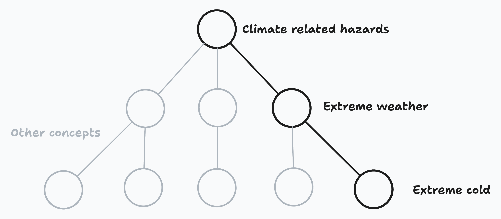
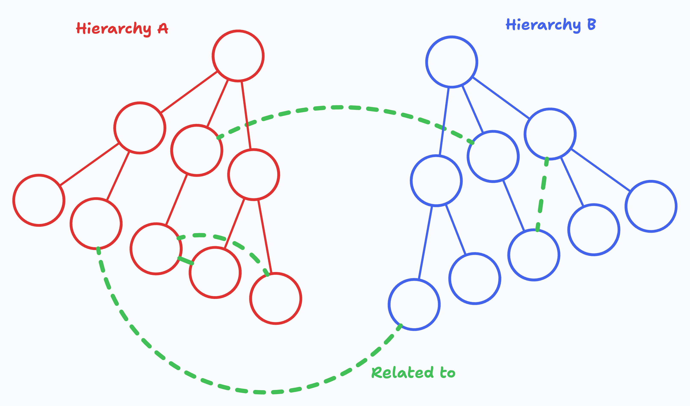
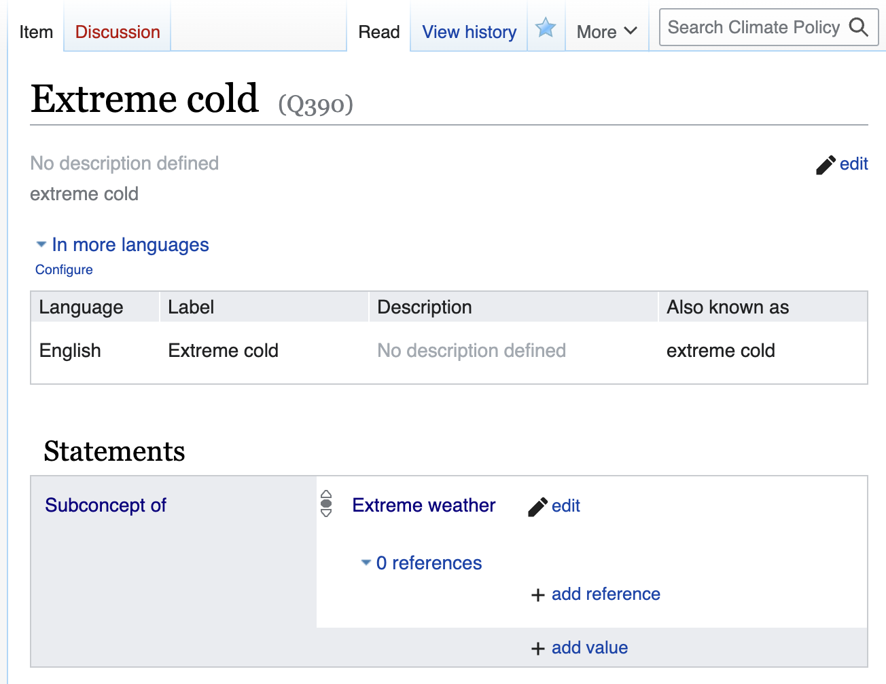

# What is the concepts store?

The concepts store is our way of managing the climate concepts we care about, and the relationships which link them together.

For example, we might have a concept for `Extreme Cold`, which is a subconcept of `Extreme Weather`, which is a subconcept of `Climate Related Hazards`.

Each of these concepts will have its own page containing some metadata about the concept, its relationships to other concepts, and a record of changes which have been made to the concept over time.

## It's a bit like wikipedia

The concepts store is similar to wikipedia, in that:

- It is a collaborative platform, where collective knowledge is built up over time by a community of users (like you!).
- The data can be queried and used in other applications, like our classifiers or the knowledge graph.
- It's built with [wikibase](https://en.wikipedia.org/wiki/Wikibase), which is the same software that powers [wikidata](https://www.wikidata.org/wiki/Wikidata:Main_Page)! If you're familiar with wikidata, you'll probably find it easy to work with the concepts store.

## It's not like wikipedia

There are a few key differences between the concepts store and wikipedia:

- **It's more focused**: The concepts store is specifically for _climate_ concepts, rather than all human knowledge. We're not trying to build a model of the entire world.
- **It's more structured**: Like _wikidata_, we're interested in collecting _structured data_ about our concepts, rather than free-text descriptions.
- **It's more connected**: We're very interested in the relationships between concepts, and how they can be used to build up a [knowledge graph](../concepts-store-vs-knowledge-graph.md). Without the relationships, we would still be able to build individual concept classifiers, but paying attention to how they're connected will allow us to _really_ unlock its potential.

## Concept pages

Each concept in the concepts store is given its own page, with fields for:

- **A preferred label**: The typical name used to refer to the concept
- **Alternative labels**: Other names which might be used to refer to the concept, including abbreviations, synonyms, or translations into other languages
- **A description**: A one or two sentence description of the concept, which could be used to disambiguate it from other, similar concepts
- **Statements**: Optional structured data about the concept, like its relationships to other concepts.

## Relationships

At the moment, we have two main types of relationships between concepts:

- **Hierarchical relationships**: These are relationships which describe how one concept is a subconcept of another. For example, `Extreme Cold` is a subconcept of `Extreme Weather`. These are often lifted from hierarchical third-party taxonomies. For example, our taxonomy of technologies is based on [the UN Climate Technology Centre and Network’s taxonomy of climate technologies](https://www.ctc-n.org/resources/ctcn-taxonomy).  
The concepts store allows you to set `Subconcept of` and `Has subconcept` relationships between concepts, which can be used to build up a hierarchy of concepts.
- **Non-hierarchical relationships**: Hierarchies are an intuitive way to start organising concepts, but they're not the best or only way. As more complexity builds up over time, limiting ourselves to a single hierarchy can become very restrictive! Non-hierarchical relationships are a way to link concepts together in a more flexible way. They also allow us to draw relationships across different hierarchies, which can be very useful for representing multiple perspectives on a single concept.
The concepts store allows you to set a `Related to` relationship between concepts, which can be used to link concepts together when hierarchical relationships aren't appropriate.

## History

Each concept page has a 'View history' tab, which shows a record of changes which have been made to the concept since it was created. You can see the 'View history' tab in the top right of the page, next to the search bar:

This should allow us to see who made changes, when they were made, and what the changes were. If we decide that a change was made in error, we can revert to an earlier version of the concept. Ideally new edits or reversions should be discussed with the team on the concept's [discussion page](./discussion-pages.md) before they're made, and the reasons for the change should be tracked in the edit summary.
